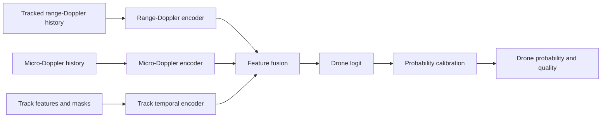

# Machine-Learning Architecture for Drone Classification

## 1. Scope

This document defines only the machine-learning subsystem used to classify a
tracked radar target as a drone or non-drone. It does not define radar control,
UDP capture, raw ADC decoding, FFT implementation, CFAR, angle estimation, or
multi-target tracking.

The ML subsystem assumes that upstream radar processing provides:

- a range-Doppler power map for every valid radar frame;
- a stable target track with range, angle, velocity, and quality measurements;
- timestamps and masks for missing or invalid frames;
- a radar/feature configuration fingerprint.

It returns a calibrated drone probability and an inference-quality result for
each target track. Alert publication and external integrations are outside this
document.

## 2. Recommended design

Use a compact, multi-input temporal classifier:

1. A range-Doppler branch learns the target's spatial and Doppler texture.
2. A micro-Doppler branch emphasizes periodic rotor signatures.
3. A track-feature branch learns target motion and measurement stability.
4. A fusion head produces a drone logit.
5. A validation-fitted calibrator converts the logit into a probability.



This design is preferred over learning directly from raw ADC data for the first
model. It reduces sample complexity, keeps the inputs interpretable, and can be
deployed efficiently on a CPU.

## 3. ML input contract

### 3.1 Supported radar profile

The first model is specific to the integrated `profile.cfg` data shape:

| Property | Value used by ML v1 |
|---|---:|
| Frame rate | approximately 30 Hz |
| Doppler bins | 64 |
| Range bins before cropping | 128 |
| Range-bin spacing | approximately 0.08365 m |
| Temporal window | 48 frames, approximately 1.6 seconds |
| Range ROI | 24 bins, approximately 2.0 m |

The model bundle must contain a configuration fingerprint. Inference must fail
to an unsupported/unknown result when the live feature configuration does not
match. Data from the repository's different `mmwave.json` profile must not be
silently resized into this model.

### 3.2 Model tensors

One example represents one target track over a causal 48-frame window.

| Tensor | Shape | Description |
|---|---|---|
| `range_doppler` | `[2, 48, 64, 24]` | Track-aligned range-Doppler ROI |
| `micro_doppler` | `[2, 48, 64]` | Target-gated Doppler history |
| `track_features` | `[48, 14]` | Physical and tracking measurements |
| `time_mask` | `[48]` | Valid temporal positions |
| `detection_mask` | `[48]` | Frames with an associated target detection |
| `range_mask` | `[48, 24]` | Valid bins where an ROI crosses a range boundary |

All arrays use `float32` at the model boundary. Masks contain zero or one.
These shapes describe one example; training and deployed inference add a
leading batch dimension `B` to every tensor.

### 3.3 Range-Doppler tensor

For each frame, center a 24-bin range crop on the track's predicted range. The
crop follows the track, so the network sees target-relative motion rather than
large changes caused only by absolute range.

The two channels are:

1. `log1p` clutter-suppressed power;
2. temporal power difference from the preceding valid frame.

Clip both channels to percentiles calculated on the training set, then
standardize using training-set mean and standard deviation. Padded values are
zero after standardization and are identified by masks. `range_mask` is applied
before spatial encoding and is also used by the inference-quality check.

Do not normalize each example independently. Per-example normalization would
remove useful absolute SNR differences and make deployment behavior unstable.

### 3.4 Micro-Doppler tensor

Derive the micro-Doppler view from the same track-aligned range-Doppler data:

1. Robustly sum power over the central target range bins.
2. Estimate local background from range bins on both sides of the target gate.
3. Subtract or ratio-normalize the target gate against the background.
4. Preserve the complete Doppler axis, including zero Doppler.

The two channels are:

1. target-gate log power;
2. target-to-local-background contrast.

The resulting `[2, 48, 64]` image lets the model learn periodic and aliased
rotor patterns without requiring the range-Doppler branch to discover the
projection itself. `time_mask` is applied before encoding and during temporal
pooling so padding cannot affect an early-window score.

### 3.5 Track features

The 14 features for each frame are:

1. range in metres;
2. sine of azimuth;
3. cosine of azimuth;
4. sine of elevation;
5. cosine of elevation;
6. radial velocity in metres/second;
7. estimated target speed;
8. estimated acceleration magnitude;
9. signal-to-noise ratio;
10. range spread;
11. angle or spatial spread;
12. association cost;
13. log position-covariance trace;
14. detection hit flag.

Continuous features are standardized with training-set statistics. Angular
features use sine/cosine so that the representation is continuous across angle
boundaries. Missing measurements are filled with zero after standardization
and identified by `detection_mask`.

## 4. Dataset design

### 4.1 Unit of learning

The unit of learning is a **track window**, not an individual radar frame. A
window has:

- a unique session ID and track ID;
- a start/end timestamp;
- the tensors and masks defined above;
- a `drone`, `non_drone`, or `unknown` label;
- truth confidence and optional drone/distractor subclass;
- radar configuration and feature-pipeline fingerprints.

Only independently verified drone tracks are positive. `unknown` examples are
excluded from the binary classification loss and retained for robustness and
out-of-distribution evaluation.

### 4.2 Window generation

- Generate 48-frame windows with a configurable training stride, initially
  8-16 frames.
- Allow left padding for young tracks so early-classification behavior can be
  evaluated.
- Keep the number of highly overlapping windows per track capped.
- Do not generate negative labels merely because a proposal does not match a
  drone label; ambiguous truth remains `unknown`.
- Cache generated features with the feature version and source-session hash.
  Invalidate the cache whenever the feature definition changes.

### 4.3 Dataset split

Split complete sessions and tracks, never individual windows. Related windows
from one flight must stay in one partition.

Recommended starting split:

- 70% training sessions;
- 15% validation sessions;
- 15% locked test sessions.

Group the split by day, site, flight, and airframe where possible. The locked
test set should include at least one site and drone airframe not seen during
training. This prevents near-identical background and rotor signatures from
inflating the result.

### 4.4 Class coverage

Positive data should include different drone models, ranges, body aspects,
heights, velocities, hover, approach, departure, crossing, takeoff, and
landing.

Negative data should emphasize hard cases:

- birds and insects;
- people, bicycles, and vehicles;
- fans and other rotating machinery;
- moving foliage;
- rain and environmental clutter;
- weak, fragmented, merged, and crossing tracks.

Long drone-free recordings are especially important because the operational
metric is false classifications per hour, not only balanced-dataset accuracy.

## 5. Model architecture

### 5.1 Range-Doppler branch

Apply one shared lightweight 2D CNN to each of the 48 range-Doppler frames.
Sharing weights ensures the same spatial feature definition at every time step.

Suggested encoder:

```text
Input per frame: [2, 64, 24]
  Conv 3x3, 2 -> 16 channels
  Depthwise-separable residual block, 16 -> 32, stride 2
  Depthwise-separable residual block, 32 -> 48, stride 2
  Depthwise-separable residual block, 48 -> 64, stride 2
  Global average pooling
Output per frame: 64 values

Stack 48 frame embeddings: [48, 64]
  Masked temporal convolution network
  Residual blocks with dilations 1, 2, 4, and 8
  Masked temporal pooling
Range-Doppler embedding: 128 values
```

Use group or layer normalization rather than batch normalization if training
batches are small or class-balanced sampling causes unstable batch statistics.

### 5.2 Micro-Doppler branch

Suggested encoder:

```text
Input: [2, 48, 64]
  Conv 3x3, 2 -> 16 channels
  Residual block, 16 -> 32, stride 2
  Residual block, 32 -> 64, stride 2
  Global average pooling
Micro-Doppler embedding: 64 values
```

The time and Doppler axes must not be accidentally exchanged during export.
Feature and ONNX parity tests should include a directional synthetic pattern to
catch this error.

### 5.3 Track branch

Suggested encoder:

```text
Input: [48, 14] plus masks
  Training-statistics normalization
  Masked 1D temporal convolution, 14 -> 32 channels
  Three residual temporal blocks with dilations 1, 2, and 4
  Masked mean and maximum pooling
Track embedding: 32 values
```

Pass `detection_mask` as an explicit input rather than forcing the network to
infer whether a standardized zero is a real measurement or missing data.

### 5.4 Fusion and output heads

```text
128 range-Doppler values
 64 micro-Doppler values
 32 track values
--------------------------
224-value fused embedding
  Layer normalization
  Linear 224 -> 128, GELU, dropout
  Linear 128 -> 64, GELU, dropout
  Linear 64 -> 1 drone logit
```

An optional auxiliary head predicts whether the window contains a stable,
classifiable radar target. It is trained jointly but is used only as an
inference quality gate. The primary output remains one binary drone logit.

Target fewer than approximately one million trainable parameters for ML v1.
The final widths and dropout are selected on validation performance and target
CPU latency.

## 6. Training architecture

### 6.1 Loss

Use weighted binary cross-entropy as the baseline:

```text
total_loss = drone_classification_loss
           + auxiliary_weight * target_quality_loss
```

Calculate class weights from training tracks, not the number of overlapping
windows. Compare focal loss only if hard negatives and severe imbalance make
weighted BCE inadequate.

Do not optimize a threshold during gradient training. The network learns a
logit; calibration and decision thresholds are fitted later on validation
sessions.

### 6.2 Sampling

- Build batches with a controlled positive/negative track ratio.
- Limit examples contributed by one track and one session per epoch.
- Prefer difficult negative tracks without allowing one site to dominate.
- Re-run the deployed model on long negative sessions after each iteration and
  add reviewed false positives to a versioned hard-negative pool.

### 6.3 Augmentation

Allowed starting augmentations are:

- small amplitude scaling;
- measured noise-floor injection;
- limited temporal and range-bin shifts;
- random valid-frame dropout with masks;
- limited Doppler-bin shift paired with consistent radial-velocity changes;
- small feature perturbations within measured calibration error.

Avoid arbitrary image rotation, unpaired Doppler flips, aggressive warping, or
mixing examples from different radar profiles. Augmentation must preserve radar
physics and the relationship between image branches and track features.

### 6.4 Optimization

Recommended baseline configuration:

- PyTorch training;
- AdamW optimizer;
- initial learning rate around `3e-4` with warm-up and cosine decay;
- weight decay around `1e-4`;
- gradient clipping;
- mixed precision when the training device supports it;
- early stopping based on validation track-level performance and false-alert
  rate, not training loss.

These values are starting points. Record every resolved hyperparameter in the
training run manifest.

## 7. Probability calibration and inference

Fit temperature scaling on validation-session logits. Use isotonic regression
only if enough independent validation tracks exist to avoid overfitting.

At inference time:

1. Validate tensor shapes, masks, feature version, and configuration
   fingerprint.
2. Run the neural model and obtain a drone logit.
3. Apply the stored probability calibrator.
4. Return `unknown` if the window has too little valid history, unsupported
   inputs, excessive missing frames, or failed target-quality checks.
5. Otherwise return the calibrated drone probability.

For a track-level class, smooth recent valid probabilities and apply hysteresis.
For example, require several consecutive or majority-positive windows to enter
the drone state, and a lower threshold over a longer duration to exit it. Both
thresholds and persistence values must be selected using validation sessions
to meet the false-positive budget.

An early score may be produced after 16 valid frames, but it should carry an
`early_window` quality flag. The standard score uses all 48 frames.

## 8. Evaluation

### 8.1 Primary metrics

Evaluate on complete held-out sessions and aggregate predictions by truth
track. Report:

- track-level drone recall;
- track-level precision;
- precision-recall AUC;
- false positive drone decisions per hour of drone-free data;
- time to correct classification after a track begins;
- probability calibration error and reliability plots;
- unknown/rejection rate;
- performance versus range, SNR, drone model, site, aspect, velocity, and
  distractor type.

Frame accuracy is secondary because many adjacent frames and windows are highly
correlated.

### 8.2 Baselines and ablations

Compare the proposed network against:

1. majority-class and SNR/range rule baselines;
2. logistic regression or gradient-boosted trees on aggregate track features;
3. range-Doppler branch only;
4. micro-Doppler branch only;
5. track branch only;
6. full fused model.

The fused model should be adopted only if it improves held-out session results
enough to justify its extra complexity.

### 8.3 Release criteria

Starting ML release goals are:

- at least 90% track-level drone recall inside the validated data envelope;
- no more than one false drone classification per hour on the locked negative
  test sessions;
- median classification time below two seconds after a stable track begins;
- calibrated probabilities with documented reliability;
- inference p95 below 10 ms for the expected active-track batch on the target
  computer;
- PyTorch and exported ONNX outputs within a defined numerical tolerance.

These goals must be revised if controlled data shows that the current radar
features cannot support them. The locked test set must not be used to tune the
model, probability calibrator, or decision thresholds.

## 9. Model artifact

Export the trained classifier to ONNX for CPU inference. A release is a bundle:

```text
models/drone-radar-v1/
  model.onnx
  manifest.json
  normalization.json
  probability_calibration.json
  decision_policy.json
  metrics.json
  model_card.md
```

The manifest records:

- model and feature-pipeline versions;
- radar configuration fingerprint;
- input names, shapes, axis order, units, and mask meanings;
- normalization values;
- training code commit and dataset-manifest hashes;
- ONNX opset and runtime version;
- supported operating envelope and known exclusions.

The model card records the dataset composition, grouped split, metrics by
condition, failure modes, and conditions where inference must return unknown.

## 10. ML code structure

```text
ai/
  config.py          # tensor schemas and configuration fingerprints
  dataset.py         # labelled track windows and grouped splits
  features.py        # shared offline/online feature construction
  augment.py         # radar-consistent training augmentation
  model.py           # multi-branch PyTorch model
  losses.py
  train.py
  calibrate.py
  evaluate.py
  export.py
  inference.py       # ONNX execution and quality checks

tests/
  test_feature_shapes.py
  test_feature_determinism.py
  test_masks.py
  test_dataset_split_leakage.py
  test_model_forward.py
  test_probability_calibration.py
  test_onnx_parity.py
```

`features.py` must be the single feature definition used by both dataset
generation and live inference. Cached features include its version and are
invalidated on any mathematical change.

## 11. ML implementation order

### Stage 1: dataset and baseline

- Define the track-window schema and grouped dataset split.
- Implement deterministic feature generation and normalization.
- Train logistic regression or gradient-boosted track-feature baselines.
- Establish track-level and false-positive-per-hour evaluation.

### Stage 2: individual neural branches

- Train and evaluate range-Doppler, micro-Doppler, and track branches
  separately.
- Verify masks and early-window behavior.
- Use ablations to identify whether each input adds real held-out value.

### Stage 3: fused model

- Train the three-branch fusion network.
- Perform hard-negative mining using reviewed false positives.
- Tune architecture and regularization on validation sessions only.

### Stage 4: calibration and export

- Fit probability calibration and decision thresholds on validation sessions.
- Export to ONNX.
- Verify PyTorch/ONNX parity, batching, axis ordering, missing-data behavior,
  and CPU latency.

### Stage 5: locked evaluation

- Run the frozen bundle once on the locked test set.
- Produce the metrics report and model card.
- Release only if the predefined track-level, false-positive, calibration, and
  latency criteria are met.
