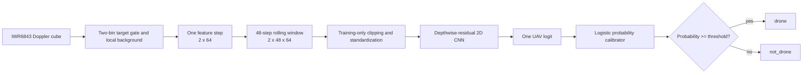

# Radar UAV Classification Architecture

## Purpose and source of truth

`classification.ipynb` trains the binary micro-Doppler classifier used by
`inference.py`. The classifier answers one question for a consistently selected
radar target: is the current 48-frame feature window a UAV (`1`) or something
else (`0`)? Live inference exposes those classes as `drone` and `not_drone`,
with `unknown` used while history is incomplete or an input is invalid.

The notebook owns dataset ingestion, splitting, normalization, training,
calibration, evaluation, and artifact export. It deliberately imports the
feature constants and model builder from `inference.py`; this keeps training and
deployment on the same tensor contract and CNN implementation.

## End-to-end architecture



The live system produces a classification only after 48 valid feature steps.
Before then, and after a feature or inference error, it returns `unknown`.

## Input and dataset contract

The feature version is
`iwr6843-micro-doppler-v4-two-range-bin`. Every model input is `float32` with
channel-first shape `[2, 48, 64]`:

| Axis | Size | Meaning |
|---|---:|---|
| Channel | 2 | Target log power; target-minus-background log power |
| Time | 48 | Consecutive feature steps, about 1.6 seconds at 30 Hz |
| Doppler | 64 | Centered Doppler bins |

For each live step, the feature extractor averages power over transmitter,
receiver, and two range bins: the selected target bin and its immediately nearer
neighbour. A separated local background is sampled on both sides of the target.
The Doppler power is reduced to 64 bins, then converted into:

1. `log1p(target_power)`;
2. `log1p(target_power) - log1p(background_power)`.

The notebook accepts labelled files below `dataset/uav/` and
`dataset/others/`. Folder names supply the labels. Supported inputs are:

| Format | Accepted payload |
|---|---|
| `.npy` | One `[2,48,64]` window, `[N,2,48,64]` windows, or `[T,2,64]` steps |
| `.npz` | `windows`, `feature_steps`, or legacy `features`, plus optional metadata |
| `.jsonl` | Consecutive `update` records containing `classification_feature` |

Step arrays are converted to 48-step windows with stride 48, giving 0%
overlap. JSONL discontinuities or missing features end the current run, so a
window is never constructed across a gap. Non-finite data and incompatible
shapes are rejected.

When provided, the loader validates `feature_version`,
`target_gate_range_bins`, and `compatible_profile_sha256` against the deployed
feature contract and `rawdatacapture/profile.cfg`. Each source file is hashed
and recorded in a dataset manifest.

## Split and preprocessing

Individual non-overlapping windows are randomly split with seed 42 and class
stratification: 70% training, 15% validation, and 15% test. A source recording
can contribute windows to all three partitions. The partitions share no window
indices and, because stride equals window length, no raw frames overlap between
adjacent generated windows.

This policy evaluates unseen time windows, not unseen recordings. Recording-
specific target, location, sensor, and background signatures may occur in all
partitions, so these results should not be interpreted as generalization to a
new capture environment. A separate capture-grouped evaluation is still needed
for that claim.

Only training windows fit preprocessing. Each channel is clipped to its
training-set 0.5th and 99.5th percentiles and standardized with its training-set
mean and standard deviation. The same four vectors are exported for live
inference:

- `clip_low`
- `clip_high`
- `channel_mean`
- `channel_std`

## CNN architecture

The deployed network is `MicroDopplerCNN`, a depthwise-separable residual 2D
CNN. Time and Doppler are treated as the two spatial dimensions. Its current
configuration is:

```text
input_channels: 2
stem_channels: 48
block_channels: [96, 208, 416]
block_strides: [(1, 2), (2, 2), (2, 2)]
dropout: 0.25
```

| Stage | Main operation | Skip operation | Output shape per example | Parameters |
|---|---|---|---:|---:|
| Input | Normalized micro-Doppler window | - | `2 x 48 x 64` | 0 |
| Stem | `3x3 Conv 2->48`, BatchNorm, SiLU | - | `48 x 48 x 64` | 960 |
| Residual block 1 | `3x3` depthwise, BN, SiLU, `1x1 Conv 48->96`, BN; stride `1x2` | `1x1 Conv 48->96`, BN; stride `1x2` | `96 x 48 x 32` | 10,128 |
| Residual block 2 | `3x3` depthwise, BN, SiLU, `1x1 Conv 96->208`, BN; stride `2x2` | `1x1 Conv 96->208`, BN; stride `2x2` | `208 x 24 x 16` | 41,824 |
| Residual block 3 | `3x3` depthwise, BN, SiLU, `1x1 Conv 208->416`, BN; stride `2x2` | `1x1 Conv 208->416`, BN; stride `2x2` | `416 x 12 x 8` | 177,008 |
| Pool | Adaptive global average pooling | - | `416` | 0 |
| Head | Dropout `0.25`, Linear `416->1` | - | scalar logit | 417 |
| **Total** |  |  |  | **230,337** |

Every residual block adds its main and projected skip paths, then applies SiLU.
The architecture has 0.58% fewer parameters than the 231,682-parameter
mmHawkeye LSTM used as a size reference in the notebook.

## Training

Training is deterministic from seed 42 where supported. Training windows receive
two lightweight augmentations:

- additive Gaussian noise with standard deviation `0.01` in normalized space;
- a 50% chance of a zero-filled Doppler shift from -2 to +2 bins.

The optimizer is AdamW with learning rate `1e-3` and weight decay `1e-4`.
The binary loss is `BCEWithLogitsLoss`, with positive weight computed as
`training negatives / training positives`. Gradients are clipped to norm 5.
Training runs for at most 100 epochs in batches of 32 and retains the epoch with
the best validation PR-AUC. It stops after 12 epochs without an improvement of
at least `1e-4`.

## Calibration, decisions, and evaluation

The CNN produces an uncalibrated scalar logit. After the best checkpoint is
restored, a one-dimensional logistic regression model is fitted to validation
logits. The validation precision-recall curve selects the probability threshold
that maximizes F1. Neither the calibrator nor threshold is fitted on test data.

The test partition is evaluated at two levels:

- window level, using every non-overlapping 48-step test window;
- source-aggregated level, averaging the selected test-window probabilities
  belonging to each source file. This is not a held-out-capture metric.

Reported metrics are recall, precision, F1, PR-AUC, ROC-AUC, Brier score, and
the `[TN, FP, FN, TP]` confusion matrix.

## Exported artifact bundle

The notebook writes three files under `Radar-UREx-output/artifacts/`:

| Artifact | Contents |
|---|---|
| `drone_bird_cnn_state.pt` | State dict, architecture name, CNN config, input shape, feature version, and two-bin gate declaration |
| `drone_bird_cnn_calibration.joblib` | Logistic calibrator, decision threshold, normalization vectors, profile hash, and dataset-manifest hash |
| `drone_bird_cnn.model_card.json` | Architecture, parameter count, training selection, metrics, class mapping, split policy, hashes, and deployment status |

`inference.py` loads all three, validates their agreement with one another and
the live radar profile, reconstructs this same CNN, normalizes a rolling raw
feature window, obtains a CPU logit, calibrates it, and applies the stored
threshold.

## Dataset requirements and evaluation warning

The window-level stratified split explicitly checks that both classes occur in
all three partitions, so two negative source recordings no longer leave the
training partition without negative windows. Each class must still contain
enough windows for stratification.

Many windows from a small number of recordings are not equivalent to many
independent recordings. Model selection and probability calibration can exploit
capture-specific signatures even without frame overlap. Operational performance
should therefore also be measured on a separate dataset whose complete
recordings, collection sessions, sites, and target instances were excluded from
training and validation.

## Architectural invariants

Changes to any item below require a new feature/model version and regenerated
artifacts:

- the two range bins or local-background selection;
- Doppler reduction or bin order;
- channel definitions or `[2,48,64]` axis order;
- window length or stride assumptions;
- clipping and normalization semantics;
- CNN configuration;
- radar profile fingerprint.

Offline generation and live inference must continue to share the feature
implementation and `_build_model` definition. Silent resizing or loading an
artifact from an older five-bin/archive feature pipeline is not compatible with
this architecture.
